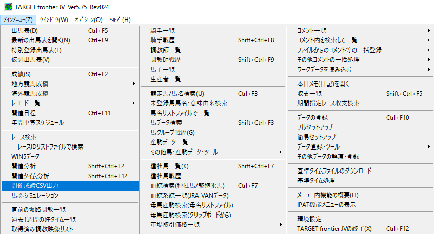
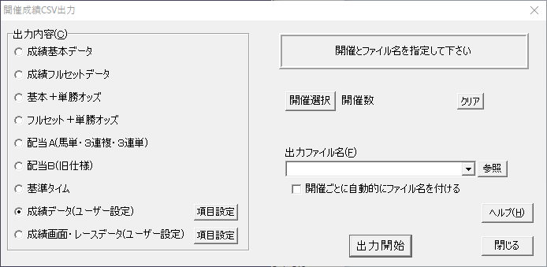
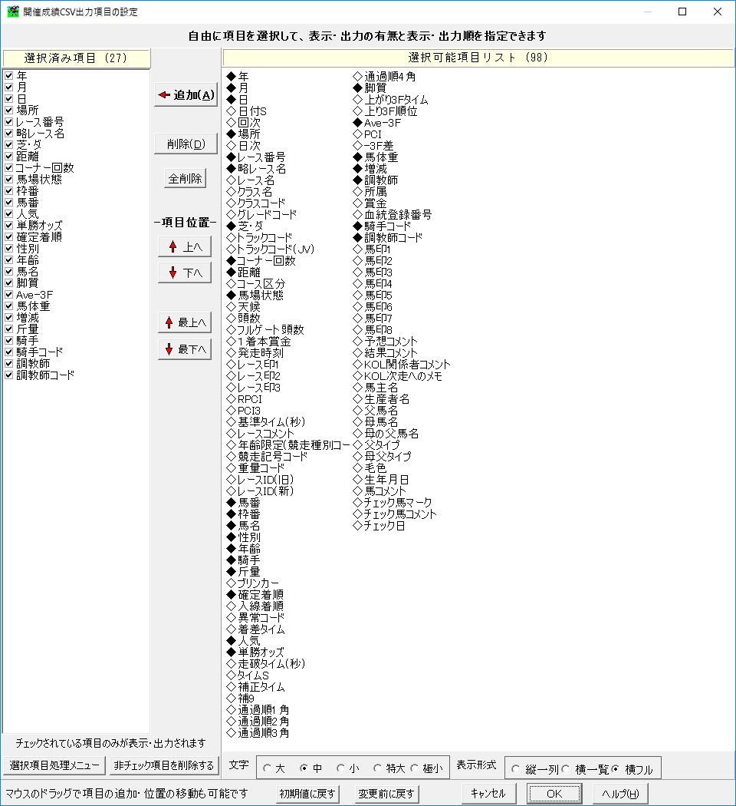

# DeepLearning 競馬予想

## 環境構築

### Install pyenv, python(annaconda)

↓を参考に Python 3.5.1 :: Anaconda 4.0.0 をインストール

http://qiita.com/oct_itmt/items/2d066801a7464a676994

### Install Chainer

```
pip install chainer
```

## 実行

### データの構築

```
python generator.py
```

### 推測

```
python predictor.py
```


## 学習データ

- [JRA VAN TARGET frontier](http://jra-van.jp/target/) から生成

各年ごとに csv 形式で Data フォルダ下に配置

### データ抽出メモ - 過去のレース

JRA VAN TARGET frontier を起動して↓の設定で出力する。
　




## データ抽出メモ - 当日のレース

TODO
